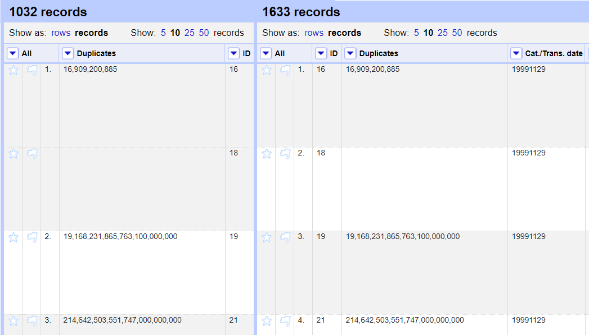
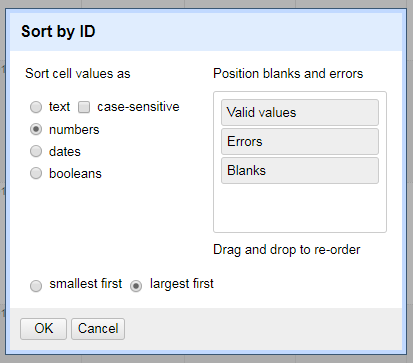
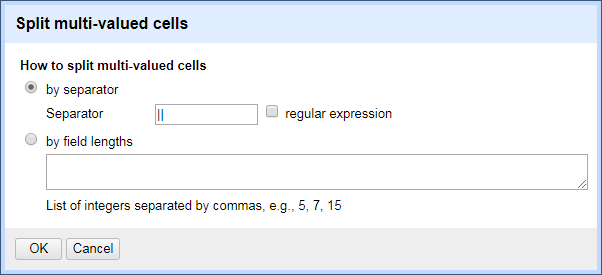

# OpenRefine, DLF Metadata QA Workshop 2018

* OpenRefine Tutorial, Hour One (10:45 AM - 12:00 PM), led by [Scotty Carlson, Metadata Coordinator @ Fondren Library, Rice University](mailto:sjc5@rice.edu)*

## Goals of This Module:
* Intro to the OpenRefine Interface
* Basic Data Assessment Tools in OR

## What is OpenRefine?
OpenRefine (formerly Google Refine) is a powerful tool for working with messy data, including tools for cleaning, transforming from one format into another, extending with web services, and connecting to external data.

Can OpenRefine be used to create data from scratch? Not really. OpenRefine is built to work with existing data, although projects can be enriched with outside data.

Download links and instructions can be found [here](https://github.com/DLFMetadataAssessment/DLFMetadataQAWorkshop17/blob/master/README.md#openrefine-recommended). OpenRefine requires a working Java runtime environment, otherwise the program will not start. Upon launch, OpenRefine will run as a local server, opening in your computer's browser. As long as OpenRefine is running, you can point your browser at either http://127.0.0.1:3333/ or http://localhost:3333/ to use it, even in several browser tabs/windows.

## Module Objectives

Which of our assessment measures can be addressed with OpenRefine?

* Completeness: Checking to see what elements/properties/attributes are present (and how much of it is missing!)
* Accuracy: Information is correct and factual (to the best of our abilities)
* Conformance to expectations: Information adheres to our expectations
* Consistency: Values are consistent within our domain, elements are represented in a consistent manner

Based on these assessment measures, what assessment techniques can be applied to work in OpenRefine?

* Do the number of rows/records match up to expectations?
* Which unique elements/fields are represented in the data?
* How much of each represented element/field is empty?
* Does the data need to be converted to intelligible formatting?
* Are data values/terms used consistently? If not, what is the formatting/entry standard for this data?
* Can the data be validated externally?
* Can the data be enriched with new information?

## Table of Contents
* Importing Data
* The OR Interface
* Assessment Tools

## Importing Data

From Refine's start screen, you can create projects from structured data files, continue working on past projects, and import projects that were exported out of OpenRefine. (Do not use the **Open Project** tab to create a project -- this is only for importing existing OpenRefine projects. More on that later.)

Refine can import TSV, CSV, Excel, JSON, and Google Data documents as well as parse raw, unformatted data copied and pasted using the Clipboard function. For this session, we will use sample CSV data from UPenn's [Schoenberg Database of Manuscripts](https://sdbm.library.upenn.edu/), which you can find [here](https://github.com/DLFMetadataAssessment/2018MetadataAnalysisWorkshop/tree/master/or_data).

*Note: while Refine does support importing XML data, [the program suffers from a bug that can generate thousands of blank lines when importing XML](https://github.com/OpenRefine/OpenRefine/issues/1095), necessitating some upfront cleanup. Instead, I recommend converting XML data to a tabular format (CSV, TSV, etc.) before importing.*

Under **Create Project**, select our sample CSV file to import on the home screen. You should now see a parsing window. Here, Refine previews what your data will look like in the main interface. Refine has automatically skipped the first row of data and parsed them to column headers. (This can be changed, if need be.) As you change parameter, so will the preview. Refine does not choose a default character encoding, so make sure you set it to **UTF-8**.

Click **Create Project**.

## The OR Interface
After the data loads, you will be staring at the default Refine interface for your new project. In the upper lefthand corner, you will see your project name (which can be changed by clicking on it) next to the OpenRefine logo. (If you need to return to the starting screen, click that logo.)

Each of the columns in the data have drop-down menus (the upside down triangles). When you select an option in a particular column (e.g. to make a change to the data), it will affect all the cells in the column currently selected. (We will discuss this more below in Faceting). The column at the extreme left of the screen is the **All Data** menu. The All drop-down will let you make changes across all columns in one pass. It also manages the Star and Flag toggles -- more on that in Faceting.

### Rows vs. Records

OpenRefine has two modes of viewing data: Rows and Records. Upon project creation, the default setting is Rows mode, where each row represents a single record in the data set -- in our case, one entry in the database. In Records mode, OpenRefine can group multiple rows as belonging to the same Record. Multi-row records happen when Refine detects multiple values within the selected record or node.

Like a database, the first column needs to act as "Key" column; if the first column has empty cells, as ours does, these will be erroneously treated as part of the previous record:



To combat this, we need to move a unique record identifier to the first column of our OpenRefine Data. This will help make sure that multi-row records stay grouped according to your understanding of a record.

Let's move the ID column to the first position: from the drop-down, select **Edit column** > **Move column to the beginning**. The Records and Rows totals should now be back to 1,633.

Set the view to Records.

### Undo/Redo & Applying Saved Actions

OpenRefine lets you undo (and redo) any number of the transformations you will enact on your imported data. Your Undo/Redo history is stored with the Project and is saved automatically as you work, so the next time you open the project, you can access your full history of transformations; this means you can always try out transformations and wipe them if needed.

The 'Undo' and 'Redo' options are accessed via the lefthand panel, which lists all the steps you have undertaken. To undo, simply click on the last step you want to preserve in the list. This will automatically wipe out all the changes made after that step. The remaining steps will continue to show as greyed out; you can reapply them by simply clicking on the last step you want to apply. However, if you undo something and then apply new transformations, the greyed out steps will disappear completely, so make sure you don't need to save any of these steps before you get back to work!

This method will also allow you to take your work on one dataset and apply it to another via simple copy-paste. If you wish to save what you have done to be re-applied later, or to an entirely different project, click **Extract**. This allows you to copy any of the steps (or all of them) as JSON (Javascript Object Notation). This JSON data can be saved to separate file and used later by clicking the **Apply** button and pasting in the JSON data.

Currently, we have only one history step: moving a column. The JSON for this step looks like this:

```
[
  {
    "op": "core/column-move",
    "description": "Move column ID to position 0",
    "columnName": "ID",
    "index": 0
  }
]
```

(Notice that all of this is structured, and therefore could be automated. The transofrmation itself is idenitfied by the `op` data, the enacted column is `columnName`, and the `index` is where the column was moved; the `description` value is what we sdee in the lefthand panel. If we wanted to, we could manually sort all of our columns by copy this JSON data, making a few changes to the `description`, `columnName`, and `index` data values.)

### Sorting

You can sort data in OpenRefine by to the drop-down menu and choosing **Sort**. Once you have sorted the data, a new 'Sort' drop-down menu will be displayed that lets you amend the existing sort (e.g., reverse the sort order), remove existing sorts, and/or make sorts permanent.

Let's try it ourselves on the ID column -- the data is (mostly) already sorted from earliest ID to latest, so we will reverse this:



(Of course, it is imperative to let Refine know that we are sorting numbers and not strings of text, otherwise our sort will not be as expected.)

Note that in the furthest lefthand column, the Refine-appointed row ID numbers are still tied to their original rows. This is because sorts in OpenRefine are temporary -- if you remove the Sort, the data will go back to its original "unordered" form. You can do this by selecting **Sort** > **Remove Sort**.

## Assessment Tools

### Faceting

The core of Refine's power lies in its use of Facets and Filtering. Facets allow you to take a macro-level look at a large amount of data by counting individual pieces of column data, and listing them. Filtering can also allow you to select subsets of your data to act on, instead of changing entire columns.

Facet information appears in the left hand panel in the OpenRefine interface. Refine supports a range of other types of facet. These include:

* **Text** facets simply list the complete text of each cell and how often those text values exactly appear in the column.
* **Numeric** and **Timeline** facets display graphs instead of lists of values, with controls to set a start and end range to filter the data displayed.
* **Scatterplot** facets are less commonly used ([see this tutorial for more information](http://enipedia.tudelft.nl/wiki/OpenRefine_Tutorial#Exploring_the_data_with_scatter_plots)).
* **Custom** facets offer a range of different customized facets, and also allow you write your own.

Let's create a facet on the *Binding* column. Select: **Facet** > **Text facet**. A new facet should appear in the lefthand window.

Clicking on any of the entries in the facet window will change the interface to include only the record(s) featuring that facet entry. (If we had set our view to Rows, only the specific rows containing that facet entry would appear.) If you move your mouse pointer over an entry in the facet window, you can select multiple facet entries using the **Include** popup next to each entry. You can also select **Invert** at the top of the facet window to automatically select the opposite of the values you chose.

If you move your mouse pointer over an entry in the facet window, you'll also see the option to **Edit** the term comes up. By changing the text in the edit box and clicking Apply, you will automatically change all instances in the data at once.

In terms of assesssment, how much of each represented element/field is empty? Try creating a custom facet for empty values: **Facet** > **Customized Facets** > **Facet by Blank**

The faceted values for *True* are cells that are empty, giving us an idea of how much data is missing. (Of course, this doesn't answer WHY the data is missing.)

### Filtering

You can also apply Text Filters which looks for a particular piece of text appearing in a column. Click the drop down menu at the top of the column you want to filter and choose **Text filter**. In the facet area, a filter box will appear. Type in the text you want to use in the Filter to display only rows which contain that text in the selected column.

In our data, typing *skin* will limit what we see to only the 3 records who values in the Facet contain the word skin somewhere.

### Splitting & Joining Multi-Valued Cells

Historically, tabular data often contains one value per field. But increasingly, data can have multiple values per certain fields. Refine can easily break apart this data and put it back together later when data transformation is complete. To do this, select **Edit Cells** > **Split Multi-Valued Cells** on a column's dropdown menu.

Let's try this on the Provenance column. Enter a single pipe character (|) in the pop-up menu:



Whenever we're done, we can rejoin this split data by selecting **Edit Cells** > **Split Multi-Valued Cells** and choosing the appropriate delimiter.
