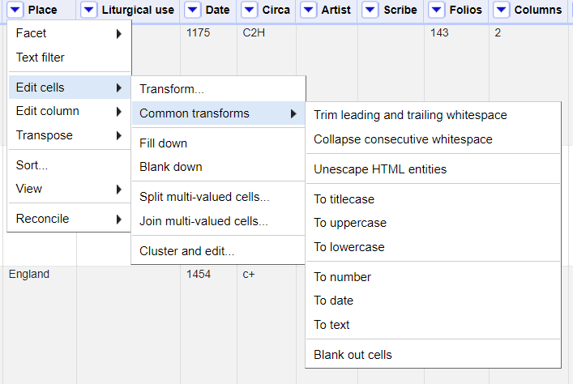
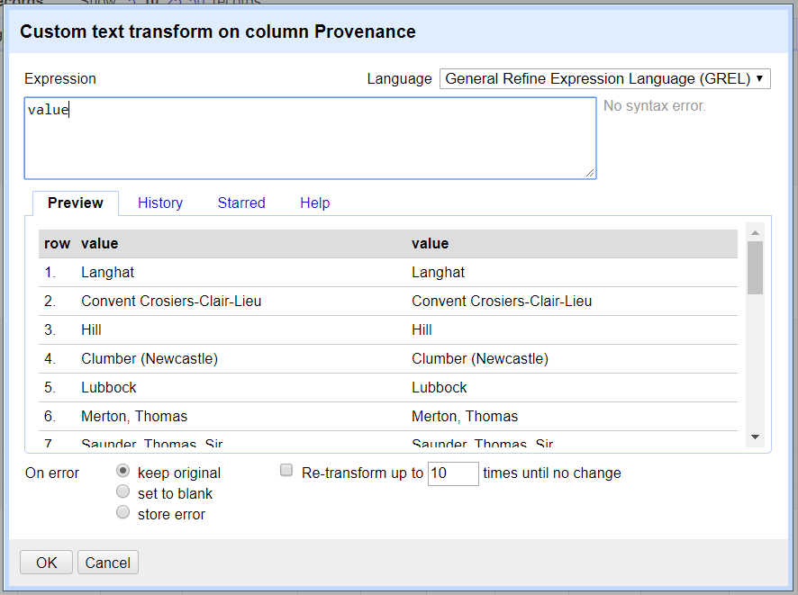
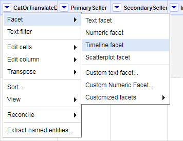
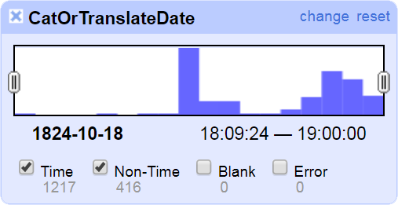

# OpenRefine, DLF Metadata QA Workshop 2018

*OpenRefine Tutorial, Hour Two (1:30 - 2:15 PM), led by [Scott Carlson, Metadata Coordinator @ Fondren Library, Rice University](mailto:sjc5@rice.edu)*

## Goals of This Module:
* Data Remediation
* Data Validation
* Data Enhancement

## Data Remediation

### Clustering

Clustering is Refine's method of algorithmically comparing a column's data against itself to look for inconsistencies. Refine uses two methods (Key Collision and Nearest Neighbor) with different functions to look for potential data inconsistencies.

On the Provenance facet window, close all filters or individual data selections, and click the **Clustering** button at the top right corner.

The Clusters from our dataset are mostly textual inconsistencies -- spelling, capitalization, etc. For each, you have the option of merging the values together, replacing inconsistencies with a single, consistent value. By default OpenRefine uses the most common value in the cluster as the new value, but you can select one of the other values by clicking the value itself, or you can simply type the desired value into the New Cell Value box.

Clustering can raise some interesting assessment questions: ***Are data values/terms used consistently? If not, what is the formatting/entry standard for this data?***

#### Exercise
<detail>

The default Cluster method, Key Collision/Fingerprint, is designed to provide as few false-positive results as possible. Other cluster functions will give you a wide range of supposed inconsistencies. Take 5-10 minutes to play around with the clustering results.

When finsihed, re-join the values with a pipe character: **Edit Cells** > **Join Multi-Valued Cells**.

</detail>

#### Note
>It is worth noting that clustering in OpenRefine works only at the syntactic level (the character composition of the cell value) and while very useful to spot errors, typos, and inconsistencies it's by no means enough to perform effective semantically-aware reconciliation.

### GREL Expressions

Transformations in OpenRefine are ways of manipulating data in columns beyond facets and filters. Transformations are predominately written in *GREL*, or [General Refine Expression Language](https://github.com/OpenRefine/OpenRefine/wiki/General-Refine-Expression-Language). If you are familiar with Python commands or Excel formulas, you may see a number of similarities in GREL.

#### Common Transformations Menu

Some common transformations are accessible directly through menu options, without having to type them directly. Click on a column drop-down and select **Edit Cells** > **Common Transformations** to see them:



Behind these menu options, however, are GREL expressions that can be applied manually:

|Common Transformation | GREL expression|
|:--------------------:|:--------------:|
|Convert the value to uppercase text|`value.toUppercase()`|
|Convert the value to lowercase text|`value.toLowercase()`|
|Convert the value to titlecase text|`value.toTitlecase()`|
|Trim leading and trailing whitespace|`value.trim()`|
|Collapse consecutive whitespace|`value.replace(/\s+/,' ')`|
|Convert the value to a number|`value.toNumber()`|
|Convert the value to a date|`value.toDate()`|
|Convert the value to a string of text|`value.toString()`|

#### Writing GREL Expressions

The transform window is where we can get into the grooves of Refine's power by executing custom-written GREL commands. To get here, select from a column drop-down: **Edit Cells** > **Transform...**. Upon opening, you'll notice the word `value` is logged in the command window; this variable stands in for the original value of the cells that we aim to change. (`value` is also a valid GREL expression -- make no changes.)

GREL expressions are written as a function being applied to some kind of data value. Some GREL functions require additional parameters or options to control what the function does. Underneath the command window, you can see a preview of the changes your expressions will inflict.



GREL transformations can also create new columns. Simply select the source column that will act as the basis for the mew and select **Edit columns** > **Add column based on this column...** from the drop-down menu. The command window will look almost the same as the Transform window. (Make sure you give your new column a name.)

Try out these GREL expressions on the Provenance column. You don't need to actually change the data, but do watch the previews on the command window and report any problems you run into!

* Change cases to uppercase and lowercase
* Replace a string of text: `value.replace('a', '@@@'))`
* You can also stack commands on top of each other: split apart strings by whitespace and then re-join them with pipes using `value.split(' ').join('|')`

#### Exercise 1: Converting to Intelligible Data

<details>

Open a transformation window on the *CatOrTranslateDate* column. We can guess these are probably dates, but right now, they are incoherent strings. Let's fix them!

Stack these three commands:

1. value.splitByLengths(4, 2, 2) = Splits the string into 3 chunks signifying YYYY, MM, and DD
2. .join('-') = rejoins those chunks with dashes
3. .toDate() = turns the join string into an object which Refine recognizes as a form of ISO 8601 combined date-time.

`value.splitByLengths(4, 2, 2).join('-').toDate()`

In the main Refine window, your column values should be in green, indicating they are no longer text strings.

Why would we change text into date content? Once datachunks are coded as dates, you can do more with them! You can rearrange the date format into a different, or more preferred, format; you can also create timeline facets to visualize your data:





</details>

#### Exercise 2: Removing Problematic Delimiters

<details>

If you facet on the *Author* column, you may see a number of values that begin with our pipe delimiter. This is because the dataset includes "empty" values (ie, only pipe-delimiters) within this column. Let's clean this up by removing these empty values.

First, undo any split values on the Author column; then, run a filter on it. We're going to use a regular expression that looks for any values that begin with pipes:

`(^\|)`

This should give us 7 values. Instead of editing them by hand, we will open a Transform window on our filtered column, and use this GREL:

`value.replace(/^\|/, '')`

This GREL expression uses a regular expression to isolate pipe characters appearing at the beginning of a string, replacing it with nothing.
</details>

## Validating Data

### Reconciliation

Reconciliation allows you to match your data against external data services to reconcile known entities. Remember when we said clustering works only at the syntactic level, and can't perform semantically-aware reconciliation? This function fills in that gap; the only trick is, it requires external data resources to support the service. (Full info on Reconciliation can be found [here](https://github.com/OpenRefine/OpenRefine/wiki/Reconciliation-Service-API).)

#### Exercise: VIAF Reconciliation

Let's try out a Reconciliation example using [Jeff Chiu's](https://github.com/codeforkjeff) VIAF Reconciliation service. (Note: Jeff's original version of this reconciliation service has been superseded by a new version, which can be found [here](https://github.com/codeforkjeff/conciliator). However, since our needs are super low for this example, we can use his deprecated public server at http://refine.codefork.com/. If you plan to play around with his service on your own, use the newer version.)

1. First, let's use our split apart *Author* column. Let's facet on the column: **Facet** > **Text facet**
2. In the facet, let's **Include** the following five author names: 'Aesop', 'Aristotle', 'Caesar, Julius', 'Chaucer, Geoffrey', and 'Dante Alighieri'. You should see 19 matching records.
3. In the dropdown menu, select **Reconcile** > **Start Reconciling**.
4. Click **Add Standard Service** and in the dialogue that appears, enter: http://refine.codefork.com/reconcile/viaf
5. Since we know we are searching for the names of people, check the bubble next to **People** under **Reconcile each cell to an entity of one of these types**.
6. Click **Start Reconciling**.

Reconciliation can take a lot of time if you have a lot to look up. However, we only have 5 names to look up, so the service should work quickly.

Once the reconciliation has completed two Facets should be created automatically: **Author: Judgement** and **Author: best candidate's score**. Close the **best candidate's score** facet, but leave the **Judgement** facet open.

According to the Judgement facet, 12 of our values (Aristotle, Caesar, and Dante) matched and 7 (Aesop and Chaucer) did not.

Aristotle, Caesar, and Dante auto-matched because the judgement score on each search had a high enough probably that the VIAF match was correct. If we look at those values in the column, we'll see that they are now links that do indeed take us to the VIAF records for [Aristotle](https://viaf.org/viaf/7524651/), [Caesar](https://viaf.org/viaf/286265178/), and [Dante](https://viaf.org/viaf/97105654/).

Aesop's top match from VIAF is [Æsop](https://viaf.org/viaf/64013451/), which has a 60 percent (0.6) probability of being correct; the second-best match for Chaucer is, maddeningly, [Chaucer, Geoffrey](https://viaf.org/viaf/100185203/) at 100 percent probability. Aesop's non-match can be understood, but why no insta-match for Chaucer? Like a Tootsie Roll Pop, the world may never know.

In any case, these are the right records, so we will click the double checkmark icon next to them, which will match all identical cells to this same VIAF entity. In our facet, non-matches should disappear.

So we're done, right? **Nope.** All we have right now is the standard VIAF name form of the entity. This is good, but we still need to extract this name form to its own column, its identifier, or both.

On the Authors column, select **Edit column** > **Add column based on this column...**. Name this column **viafIDs**. In the transformation window, enter your GREL:
`'https://viaf.org/viaf/' + cell.recon.match.id + '/'`
This will not only extract the identifier for the entity, but create the full VIAF URI.

Once you have this new column, reconciliation data can be dispatched by selecting **Reconcile** > **Actions** > **Clear reconciliation data**.

## Data Enhancement

### Cross, OpenRefine's VLOOKUP Function

OpenRefine does just edit and remediate data -- it's also built to enrich what's already there from outside sources. One of these outside sources can be another Refine project, using a GREL expression not unlike a VLOOKUP formula in Excel..

We're going to head back to our OR data and find the TAR package, *Auction-Houses.openrefine.tar.gz*. let's open a new Refine window by clicking on the logo and click **Import Project.** Select the TAR file; a new project, *Auction-Houses*, should open.

*Auction-Houses* contains address information for several of the entities in the *PrimarySeller* column in our Schoenberg data. We're going to use the *PrimarySeller* and *Company* columns as our matchpoint. The structure of a Cross GREL expression looks like this:

`cell.cross("[Project with Data We Want]", "[Project's Matching Column]")[0].cells["[Column Data We Want]"].value`

So, we will select **Add Column** > **Add column based on this column** on *PrimarySeller* and make a new column, *Addresses*, using this GREL expression:

`cell.cross("Auction-Houses", "Company")[0].cells["Address"].value`

You should now have a new column of addresses next to *PrimarySeller*.

### Enriching with Web APIs

Depending on what you need or want from your data, it may be pertinent to enrich existing data from an outside source. Open web APIs are great for this, because Refine can send out such web API requests and parse the results (especially if the response is in JSON, XML, or HTML).

What if we wanted our Schoenberg data to contain geolocational data for the auction houses that sold some of the manuscripts? That metadata could potentially fuel a discovery layer to see where most of the manuscripts were sold.

Unfortunately, as of summer of 2018, Google's robust Maps API has been restricted in favor of subscription costs for their services. In the following activity, we will use a very small dataset as a demo API with some geocoded metadata.

1. First, navigate to the last column in the project, *api_codes*. Select records from three countries in the *Place* column (Spain, Egypt, and the Netherlands) have been given one-digit identifiers.
2. On the dropdown for *api_codes*, select **Add Column** > **Add column by fetching URLs**. Name this new column *JSON*.
3. Run this GREL expression: `"https://my-json-server.typicode.com/DLFMetadataAssessment/2018MetadataAnalysisWorkshop/entities/=" + value`
4. Set the *Throttle Delay* to 1,000 miliseconds (aka one second).

The new column should be filled with JSON data from our demo API. Now let's get the latitude and longitude coordinates for each country.

5. On the dropdown for *JSON*, select **Add Column** > **Add column based on this column**. Name this new column *Coordinates*.
6. Run this GREL expression: `value.parseJson()["lat"] + ', ' + value.parseJson()["lng"]`

This new column is filled with parsed JSON data featuring the coordinates for each country.

## Getting Data Out of OpenRefine

When your data has been cleaned to your satisfaction, you can export it to a variety of different file formats. Be sure all text filters and facet windows are closed, and that you have joined any split multi-valued data before you export! Clicking on the **Export** button in the upper right corner of the screen will display the export file formats available. **Export Project**, on the other hand, will save a copy of your Refine project as a TAR archive that can be shared with other people and opened in other Refine installations.

Refine's **Templating** function allows you to export your data in a "roll your own" fashion. As Refine's wiki states, "this is useful for formats that we don't support natively yet, or won't support." Currently, Templating is set up to generate a single JSON document of your data by default; with a few changes, we can set up a template to put our enriched Schoenberg data out to, say, an XML file. You'll need to fill out these spaces with the below template:

Prefix:
```
<?xml version="1.0" encoding="UTF-8"?>
<records>
[blank line break]
```

Row template:
```
   <record>
      <ID>{{cells["ID"].value,"xml")}}</ID>
      <Duplicates>{{escape(cells["Duplicates"].value,"xml")}}</Duplicates>
      <CatOrTranslateDate>{{escape(cells["CatOrTranslateDate"].value,"xml")}}</CatOrTranslateDate>
      <PrimarySeller>{{escape(cells["PrimarySeller"].value,"xml")}}</PrimarySeller>
      <LatLng>{{escape(cells["LatLng"].value,"xml")}}</LatLng>
      <SecondarySeller>{{escape(cells["SecondarySeller"].value,"xml")}}</SecondarySeller>
      <InstitutionOrCollection>{{escape(cells["InstitutionOrCollection"].value,"xml")}}</InstitutionOrCollection>
      <Buyer>{{escape(cells["Buyer"].value,"xml")}}</Buyer>
      <CatalogueID>{{escape(cells["CatalogueID"].value,"xml")}}</CatalogueID>
      <LotOrCat>{{escape(cells["LotOrCat"].value,"xml")}}</LotOrCat>
      <Price>{{escape(cells["Price"].value,"xml")}}</Price>
      <Currency>{{escape(cells["Currency"].value,"xml")}}</Currency>
      <Sold>{{escape(cells["Sold"].value,"xml")}}</Sold>
      <Source>{{escape(cells["Source"].value,"xml")}}</Source>
      <CurrentLocation>{{escape(cells["CurrentLocation"].value,"xml")}}</CurrentLocation>
      <Author>{{escape(cells["Author"].value,"xml")}}</Author>
      <AuthorVariant>{{escape(cells["AuthorVariant"].value,"xml")}}</AuthorVariant>
      <viafIDs>{{escape(cells["viafIDs"].value,"xml")}}</viafIDs>
      <Title>{{escape(cells["Title"].value,"xml")}}</Title>
      <Language>{{escape(cells["Language"].value,"xml")}}</Language>
      <Material>{{escape(cells["Material"].value,"xml")}}</Material>
      <Place>{{escape(cells["Place"].value,"xml")}}</Place>
      <LiturgicalUse>{{escape(cells["LiturgicalUse"].value,"xml")}}</LiturgicalUse>
      <Date>{{escape(cells["Date"].value,"xml")}}</Date>
      <Circa>{{escape(cells["Circa"].value,"xml")}}</Circa>
      <Artist>{{escape(cells["Artist"].value,"xml")}}</Artist>
      <Scribe>{{escape(cells["Scribe"].value,"xml")}}</Scribe>
      <Folios>{{escape(cells["Folios"].value,"xml")}}</Folios>
      <Columns>{{escape(cells["Columns"].value,"xml")}}</Columns>
      <Lines>{{escape(cells["Lines"].value,"xml")}}</Lines>
      <Height>{{escape(cells["Height"].value,"xml")}}</Height>
      <Width>{{escape(cells["Width"].value,"xml")}}</Width>
      <Binding>{{escape(cells["Binding"].value,"xml")}}</Binding>
      <Provenance>{{escape(cells["Provenance"].value,"xml")}}</Provenance>
      <Comments>{{escape(cells["Comments"].value,"xml")}}</Comments>
      <Coordinates>{{escape(cells["Coordinates"].value,"xml")}}</Coordinates>
   </record>
```

Row separator:
```
[blank line break]
```

Suffix:
```
[blank line break]
</records>
```
